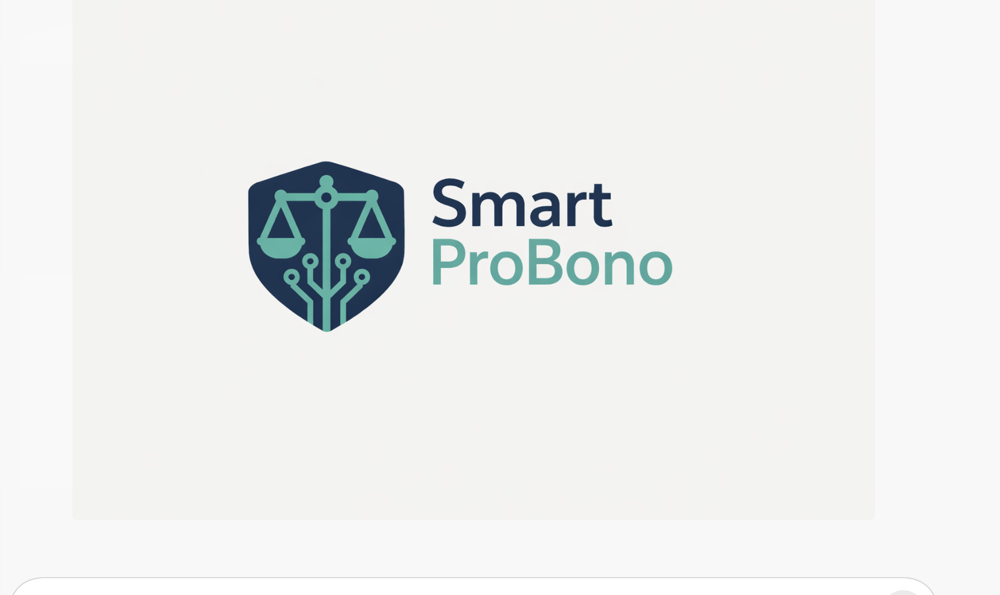

# SmartProBono — Mobile Safety Companion

<!-- repo-intro:start -->
**Project snapshot:** SmartProBono is a shipped iOS safety companion that helps people document important moments, share location with trusted contacts, and follow calm, structured guidance during stressful situations.

**What it demonstrates:** Expo / React Native · TypeScript · local-first mobile architecture · location + contacts + audio/video APIs · session recovery · App Store shipping · Next.js support site.
<!-- repo-intro:end -->

<p>
  
</p>

**App Store:** https://apps.apple.com/us/app/smartprobono/id6759347017

> The repository name and some older internal docs still use **Pocket Buddy / SmartProBono Pocket**. The public App Store product is **SmartProBono**.

## Product at a glance

| Area | Current product |
| --- | --- |
| Safety Mode | Start a safety session, capture location, notify a trusted contact, record when enabled, and follow calm guidance |
| Travel Mode | Track an active route/session and keep it in the same local session history |
| Kid Track | Start kid-focused tracking sessions and configure in-app schedule prompts |
| Trusted Circle | Primary emergency contact plus additional trusted contacts |
| Recording | Audio/video-capable safety recording flows with local save/share/delete controls |
| History | Local session history with timestamps, locations, recordings, and session details |
| Family Hub | At-a-glance trusted-circle, Kid Track schedule, and recent Kid Track activity |
| Health Check | Read-only diagnostic view for app version, permissions, session state, contacts, settings, and schedule |
| Onboarding | Guided setup for contact, recording disclosure/preferences, and location permission |
| Support web | Next.js marketing, privacy, support, and Pocket Buddy legal/support pages |

## Current mobile architecture

`SmartProBonoPocket/` contains the Expo / React Native application.

Key areas:

- `src/screens/` — onboarding, home, Safety/Travel/Kid Track sessions, Family Hub, recording, history, settings, health check
- `src/services/` — active-session runtime and session orchestration
- `src/storage/` — local contacts, events, recordings, settings, schedule, and persisted live sessions
- `src/navigation/` — gated onboarding + tab/stack navigation
- `assets/` — App Store/mobile branding
- `eas.json` — Expo Application Services build and submission profiles

The app currently uses a **local-first architecture** rather than a hosted user database. Sensitive session data is kept on-device unless the user explicitly shares it through platform sharing/SMS flows.

## Mobile flow

1. Complete onboarding.
2. Add a trusted emergency contact.
3. Choose a session type such as Safety, Travel, or Kid Track.
4. Start the session and capture location.
5. Use recording and calm guidance when appropriate.
6. End the session and keep the event in local history.
7. Share selected information only when the user chooses to.

## Stack

- Expo SDK 54
- React Native 0.81
- React 19
- TypeScript
- React Navigation
- AsyncStorage
- Expo Location
- Expo Contacts
- Expo Audio
- Expo Camera
- Expo File System
- Expo Sharing
- EAS Build / Submit / Updates
- Next.js support + marketing site

## Repository structure

- `SmartProBonoPocket/` — mobile app
- `web-next/` — current Next.js marketing/support site
- `web/` — older/supporting web work retained in the repo
- `MARKETING.md` — current product messaging
- `NEXT_STEPS.md` — next release priorities

## Local setup

### Mobile

```bash
cd SmartProBonoPocket
npm install
npx expo start
```

### Support site

```bash
cd web-next
npm install
npm run dev
```

## Product status

**Shipped.** SmartProBono is publicly available on the Apple App Store.

The repository also contains work that may be ahead of the currently published store build, including Family Hub / Kid Track support and additional diagnostics. Before the next store submission, the production build should be tested against the current `main` branch as one complete flow.

## Safety and scope

SmartProBono is a support and documentation tool. It is not a substitute for emergency services, a lawyer, or individualized legal advice.

Recording and privacy laws vary by jurisdiction. Recording features are presented with user-facing disclosures and should only be used where lawful.
